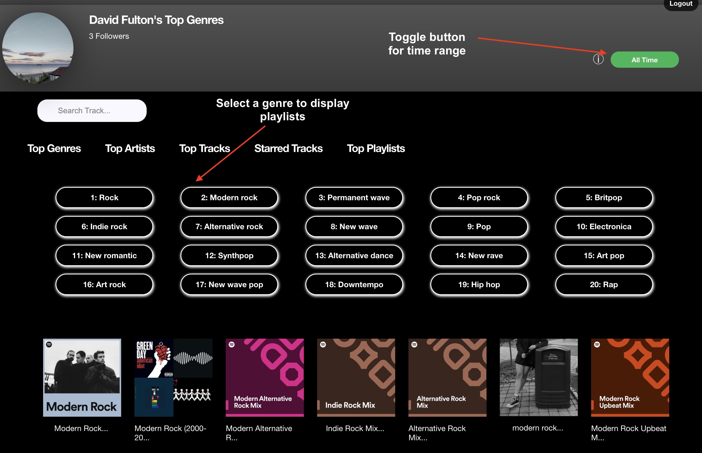
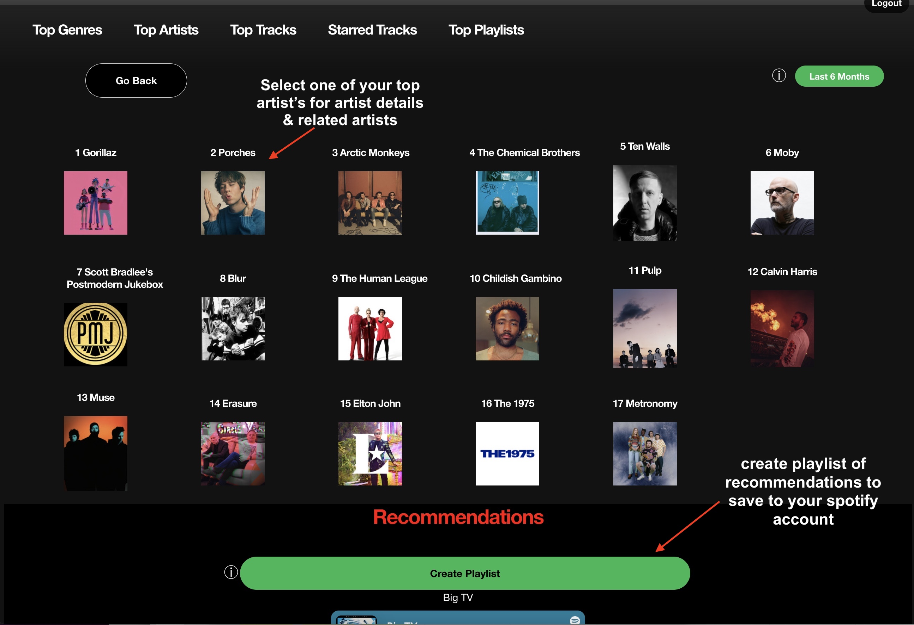
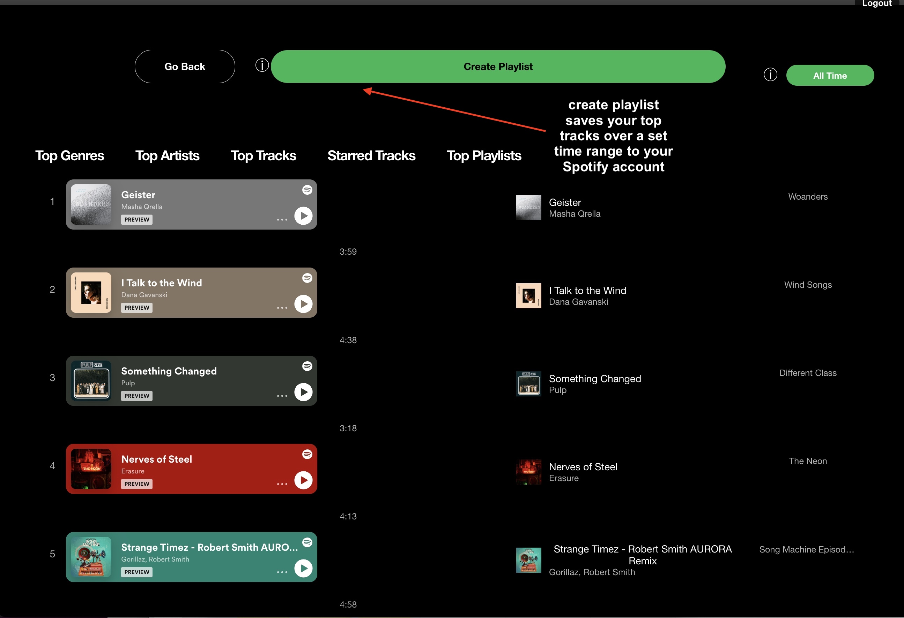

#  Spotify User Profile Dashboard

### This application is built using 
- Node, Express,
- React

### Dependencies: 
-  spotify-web-api-js [see https://github.com/thelinmichael/spotify-web-api-node]
-  Styled Components
-  axios, concurrently, nodemon, querystring, dotenv, cookie-parser

##### Authorization Code flow 
* This application uses the Authorization code workflow - see for more info https://developer.spotify.com/documentation/general/guides/authorization/

## Installation
 

Clone the repository and install its dependencies running:

    $ npm install at both the root folder and the client folder.
    $ npm start thereafter from the root folder to run both server and client

  

  

  

##### TO-DO
 - remove axios as a dependency and replace with fetch
 - remove spotify-web-api-js package and replace with spotify api http endpoints
 - Modify authorization workflow to use PKCE
 - add rate limiting to server
 - Clean-up styling and refactor inline and css-in-jsx to styled components

 
 
